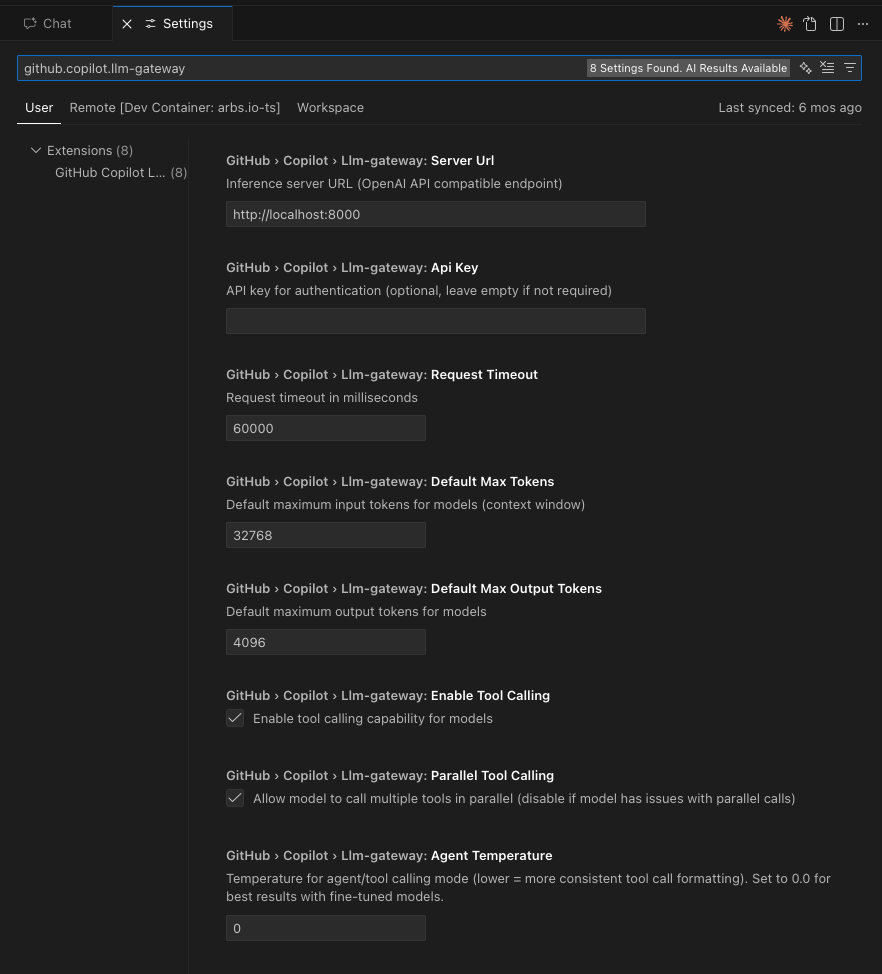
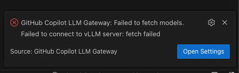
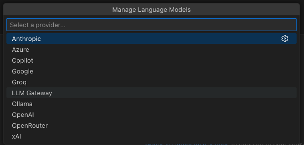
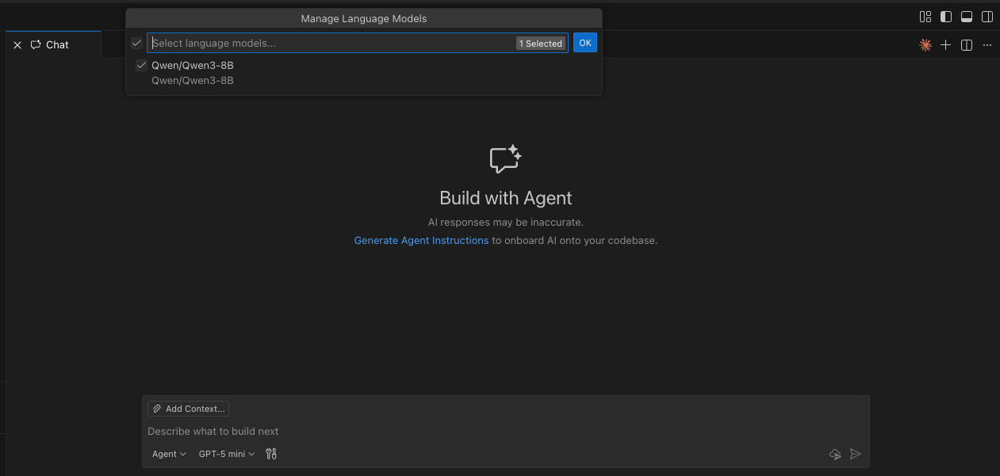
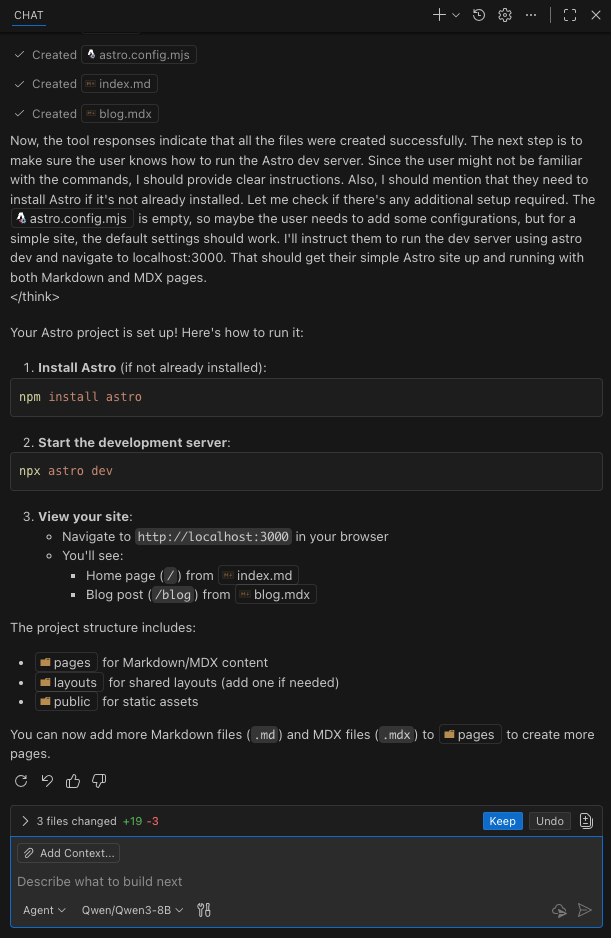

# GitHub Copilot LLM Gateway


[](https://github.com/arbs-io/github-copilot-llm-gateway/issues)


[](https://sonarcloud.io/summary/new_code?id=arbs-io_github-copilot-llm-gateway)
[](https://sonarcloud.io/summary/new_code?id=arbs-io_github-copilot-llm-gateway)
[](https://sonarcloud.io/summary/new_code?id=arbs-io_github-copilot-llm-gateway)
[](https://sonarcloud.io/summary/new_code?id=arbs-io_github-copilot-llm-gateway)
[](https://sonarcloud.io/summary/new_code?id=arbs-io_github-copilot-llm-gateway)

Extend GitHub Copilot with open-source language models running on your own infrastructure.

## About

**GitHub Copilot LLM Gateway** is a companion extension for GitHub Copilot that adds support for self-hosted open-source models. It seamlessly integrates with the Copilot chat experience, allowing you to use models like Qwen, Llama, and Mistral alongside—or instead of—the default Copilot models.

This extension connects to any **OpenAI-compatible inference server**, giving you complete control over your AI-assisted development environment.

### Key Benefits

| Benefit                | Description                                                                      |
| ---------------------- | -------------------------------------------------------------------------------- |
| **Data Sovereignty**   | Your code never leaves your network. All inference happens on your own hardware. |
| **Zero API Costs**     | No per-token fees. Use your GPU resources without usage limits.                  |
| **Model Choice**       | Access thousands of open-source models from Hugging Face and beyond.             |
| **Offline Capable**    | Work without internet once models are downloaded.                                |
| **Full Customization** | Fine-tune models for your specific codebase or domain.                           |

### Compatible Inference Servers

- [vLLM](https://github.com/vllm-project/vllm) — High-performance inference (recommended)
- [Ollama](https://ollama.ai/) — Easy local deployment
- [llama.cpp](https://github.com/ggml-org/llama.cpp) — CPU and GPU inference
- [Text Generation Inference](https://github.com/huggingface/text-generation-inference) — Hugging Face's server
- [LocalAI](https://localai.io/) — OpenAI API drop-in replacement
- Any OpenAI Chat Completions API-compatible endpoint

## Getting Started

### Prerequisites

- **VS Code** 1.106.0 or later
- **GitHub Copilot** extension installed and signed in
- **Inference server** running with an OpenAI-compatible API

### Step 1: Install the Extension

Install **GitHub Copilot LLM Gateway** from the VS Code Marketplace.

<!-- Screenshot: Extension in marketplace -->

### Step 2: Start Your Inference Server

Launch your inference server with tool calling enabled. Here's an example using vLLM:

```bash
vllm serve Qwen/Qwen3-8B \
    --enable-auto-tool-choice \
    --tool-call-parser hermes \
    --max-model-len 32768 \
    --gpu-memory-utilization 0.95 \
    --host 0.0.0.0 \
    --port 42069
```

Verify the server is running:

```bash
curl http://localhost:42069/v1/models
```

### Step 3: Configure the Extension

1. Open VS Code **Settings** (`Ctrl+,` / `Cmd+,`)
2. Search for **"Copilot LLM Gateway"**
3. Set **Server URL** to your inference server address (e.g., `http://localhost:8000`)
4. Configure other settings as needed (token limits, tool calling, etc.)



> **Note**: If the server is unreachable, you'll see an error notification with a quick link to settings:
>
> 

### Step 4: Select Your Model in Copilot Chat

1. Open **GitHub Copilot Chat** (`Ctrl+Alt+I` / `Cmd+Alt+I`)
2. Click the **model selector** dropdown at the bottom of the chat panel
3. Click **"Manage Models..."** to open the model manager



4. Select **"LLM Gateway"** from the provider list
5. Enable the models you want to use from your inference server



### Step 5: Start Chatting

Your self-hosted models now appear alongside the default Copilot models. Select one and start coding with AI assistance!



The model integrates seamlessly with Copilot's features including:
- **Agent mode** for autonomous coding tasks
- **Tool calling** for file operations, terminal commands, and more
- **Context awareness** with `@workspace` and file references

## Configuration

Configure the extension through VS Code Settings (`Ctrl+,` / `Cmd+,`) → search "Copilot LLM Gateway".

### Connection Settings

| Setting             | Default                 | Description                                         |
| ------------------- | ----------------------- | --------------------------------------------------- |
| **Server URL**      | `http://localhost:8000` | Base URL of your OpenAI-compatible inference server |
| **API Key**         | _(empty)_               | Authentication key if your server requires one      |
| **Request Timeout** | `60000`                 | Request timeout in milliseconds                     |

### Model Settings

| Setting                       | Default | Description                                                           |
| ----------------------------- | ------- | --------------------------------------------------------------------- |
| **Default Max Tokens**        | `32768` | Context window size (input tokens). Match to your model's capability. |
| **Default Max Output Tokens** | `4096`  | Maximum tokens the model can generate per response                    |

### Tool Calling Settings

These settings control how the extension handles agentic features like code editing and file operations.

| Setting                   | Default | Description                                                                                            |
| ------------------------- | ------- | ------------------------------------------------------------------------------------------------------ |
| **Enable Tool Calling**   | `true`  | Allow models to use Copilot's tools (file read/write, terminal, etc.)                                  |
| **Parallel Tool Calling** | `true`  | Allow multiple tools to be called simultaneously. Disable if your model struggles with parallel calls. |
| **Agent Temperature**     | `0.0`   | Temperature for tool calling mode. Lower values produce more consistent tool call formatting.          |

> **Tip**: If your model outputs tool descriptions as text instead of actually calling tools, try setting **Agent Temperature** to `0.0` and disabling **Parallel Tool Calling**.

## Recommended Models

These models have been tested with good tool calling support:

| Model                                | VRAM  | Tool Support | Best For                  |
| ------------------------------------ | ----- | ------------ | ------------------------- |
| **Qwen/Qwen3-8B**                    | ~16GB | Excellent    | General coding, 32GB GPU  |
| **Qwen/Qwen2.5-7B-Instruct**         | ~14GB | Excellent    | Balanced performance      |
| **Qwen/Qwen2.5-14B-Instruct**        | ~28GB | Excellent    | Higher quality (48GB GPU) |
| **meta-llama/Llama-3.1-8B-Instruct** | ~16GB | Good         | Alternative to Qwen       |

> **Important**: Avoid **Qwen2.5-Coder** models for tool calling—they have [known issues](https://github.com/vllm-project/vllm/issues/10952) with vLLM's tool parser. Use standard Qwen2.5-Instruct or Qwen3 models instead.

## vLLM Setup Reference

### Installation

```bash
pip install vllm
```

### Tool Call Parsers

Each model family requires a specific parser:

| Model Family   | Parser        | Example                          |
| -------------- | ------------- | -------------------------------- |
| Qwen2.5, Qwen3 | `hermes`      | `--tool-call-parser hermes`      |
| Qwen3-Coder    | `qwen3_coder` | `--tool-call-parser qwen3_coder` |
| Llama 3.1/3.2  | `llama3_json` | `--tool-call-parser llama3_json` |
| Mistral        | `mistral`     | `--tool-call-parser mistral`     |

### VRAM Requirements

Approximate memory for BF16 (full precision) inference:

| Model Size | Model VRAM | 32K Context Total     |
| ---------- | ---------- | --------------------- |
| 7-8B       | ~16GB      | ~22GB                 |
| 14B        | ~28GB      | ~34GB                 |
| 30B+       | ~60GB      | Requires quantization |

### Example Server Commands

**Qwen3-8B** (Recommended):

```bash
vllm serve Qwen/Qwen3-8B \
    --enable-auto-tool-choice \
    --tool-call-parser hermes \
    --max-model-len 32768 \
    --gpu-memory-utilization 0.95 \
    --host 0.0.0.0 \
    --port 42069
```

**Llama 3.1 8B**:

```bash
vllm serve meta-llama/Llama-3.1-8B-Instruct \
    --enable-auto-tool-choice \
    --tool-call-parser llama3_json \
    --max-model-len 32768 \
    --host 0.0.0.0 \
    --port 42069
```

**Quantized Model** (limited VRAM):

```bash
vllm serve Qwen/Qwen2.5-14B-Instruct-AWQ \
    --enable-auto-tool-choice \
    --tool-call-parser hermes \
    --max-model-len 16384 \
    --gpu-memory-utilization 0.95 \
    --host 0.0.0.0 \
    --port 42069
```

## Troubleshooting

### Model not appearing in Copilot

1. Verify server is running: `curl http://your-server:port/v1/models`
2. Check **Server URL** in settings matches exactly
3. Run command **"Copilot LLM Gateway: Test Server Connection"** from the Command Palette

### "Model returned empty response"

The model failed to generate output. Try:

1. **Check tool parser** — Ensure `--tool-call-parser` matches your model family
2. **Disable tool calling** — Set `github.copilot.llm-gateway.enableToolCalling` to `false` to test basic chat
3. **Reduce context** — Your conversation may exceed the model's limit

### Tools described but not executed

The model outputs text like "Using the read_file tool..." instead of actually calling tools.

1. Use **Qwen3-8B** or **Qwen2.5-7B-Instruct** (avoid Coder variants)
2. Set **Agent Temperature** to `0.0`
3. Disable **Parallel Tool Calling**
4. Ensure server has `--enable-auto-tool-choice` flag

### Out of memory errors

- Reduce `--max-model-len` (try 8192 or 16384)
- Use a quantized model (AWQ, GPTQ, FP8)
- Choose a smaller model

## Commands

Access from the Command Palette (`Ctrl+Shift+P` / `Cmd+Shift+P`):

| Command                                                | Description                                 |
| ------------------------------------------------------ | ------------------------------------------- |
| **GitHub Copilot LLM Gateway: Test Server Connection** | Test connectivity and list available models |

## Support

- **Issues & Feature Requests**: [GitHub Issues](https://github.com/arbs-io/github-copilot-llm-gateway/issues)
- **Discussions**: [GitHub Discussions](https://github.com/arbs-io/github-copilot-llm-gateway/discussions)

## License

MIT License — see [LICENSE](LICENSE) for details.

---

_This extension is not affiliated with GitHub or Microsoft. GitHub Copilot is a trademark of GitHub, Inc._
