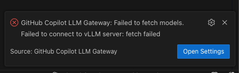
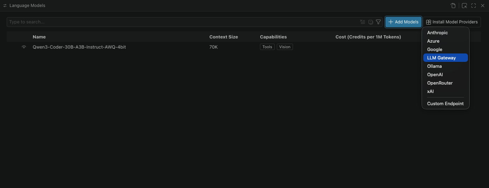
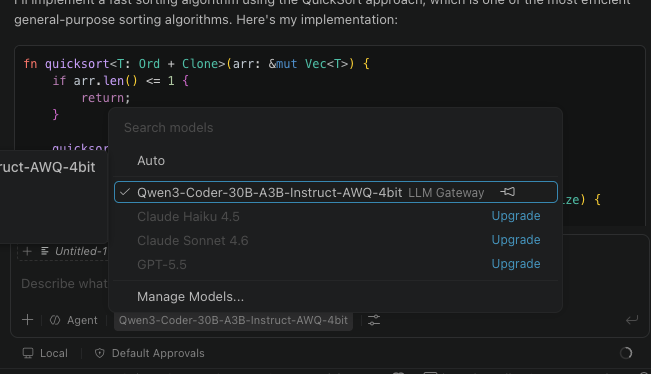
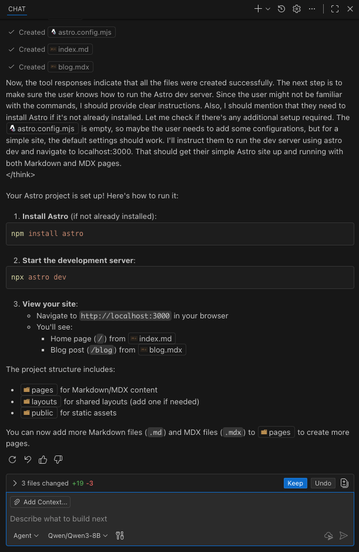
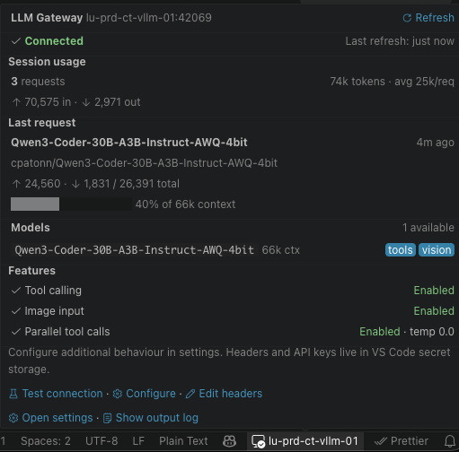

# GitHub Copilot LLM Gateway


[](https://github.com/arbs-io/github-copilot-llm-gateway/issues)


[](https://sonarcloud.io/summary/new_code?id=arbs-io_github-copilot-llm-gateway)
[](https://sonarcloud.io/summary/new_code?id=arbs-io_github-copilot-llm-gateway)
[](https://sonarcloud.io/summary/new_code?id=arbs-io_github-copilot-llm-gateway)
[](https://sonarcloud.io/summary/new_code?id=arbs-io_github-copilot-llm-gateway)
[](https://sonarcloud.io/summary/new_code?id=arbs-io_github-copilot-llm-gateway)

A robustness layer for running **self-hosted open-source models** inside GitHub Copilot Chat — built for the models and servers that don't _quite_ behave.

## Do I need this, or is native BYOK enough?

Since **VS Code 1.122**, VS Code ships a built-in **BYOK "Custom Endpoint" provider** (Generally Available) that connects any OpenAI-compatible server — vLLM, Ollama, llama.cpp, LM Studio, LocalAI — directly to Copilot chat, agent mode, tools, and MCP, with **no extension and no GitHub sign-in required**. For most setups that's the simplest path, and you should start there: run **Chat: Manage Language Models** from the Command Palette and add a Custom Endpoint. This extension uses the same bring-your-own-key (BYOK) model system, so it doesn't need a GitHub sign-in either; the choice between the two is about how your model behaves, not about accounts.

**This extension is for the harder cases native BYOK doesn't handle.** Native BYOK trusts your endpoint as-is and does no quirk-smoothing — its own docs note that tool-call reliability "depends on your server's tool-call parser." When you're stuck with a specific small or quantized model, or a server you can't reconfigure, that's where this extension earns its place:

| Use **native BYOK** (built in) when…                                       | Use **this extension** when…                                                       |
| -------------------------------------------------------------------------- | ---------------------------------------------------------------------------------- |
| Your model + server are well-behaved                                       | Tool calls fail with malformed / truncated JSON                                    |
| You can pick the model and configure the server (e.g. `--tool-call-parser`) | You're locked to a specific small / quantized model that emits sloppy tool calls   |
| You want the simplest, first-party path                                    | Reasoning models leak `<think>` blocks into chat or burn their budget mid-thought  |
| You want cloud providers too (Anthropic, OpenAI, Gemini…)                  | You hit context-length errors and want safe, automatic token budgeting             |

If native BYOK already works well for you, you don't need this extension. If your self-hosted small models keep tripping over tool calling, reasoning tags, or context limits, read on.

## About

**GitHub Copilot LLM Gateway** registers as a language model provider inside GitHub Copilot Chat and adds a **resilience layer** for self-hosted open-source models served over any OpenAI-compatible API (vLLM, Ollama, llama.cpp, LM Studio, LocalAI, LiteLLM). Models like Qwen, Llama, and Mistral appear in the Copilot model picker alongside the defaults — but unlike a plain passthrough, the gateway actively repairs the rough edges that small and quantized models produce.

### What it does that a plain connection doesn't

| Capability                   | What it solves                                                                                                                                                                                                                                            |
| ---------------------------- | -------------------------------------------------------------------------------------------------------------------------------------------------------------------------------------------------------------------------------------------------------- |
| **Tool-call JSON repair**    | Recovers truncated / malformed tool-call arguments (unclosed strings or braces, trailing commas) instead of aborting the call, and fills in missing _required_ arguments from the tool schema so the call still runs.                                      |
| **Streaming tool-call assembly** | Reassembles tool calls from incremental stream deltas across multiple wire formats, tolerating late or missing call IDs.                                                                                                                              |
| **Reasoning / thinking handling** | Routes `<think>`/`<thinking>` blocks (and a separate `reasoning_content` field) into Copilot's thinking UI instead of dumping chain-of-thought into the chat — handling tags split across stream chunks and LM Studio's stray-tag quirk, with a fallback when a model exhausts its budget mid-thought. |
| **Safe context budgeting**   | Auto-detects the real context window from `/v1/models` (across vLLM, LiteLLM, Ollama, llama.cpp, and LocalAI field names) and shrinks `max_tokens` conservatively so small servers don't return context-length errors.                                            |
| **Tool-call tuning**         | Sends a low agent temperature and exposes parallel-tool-call / tool-choice toggles to stabilize tool-call formatting from finicky fine-tuned models.                                                                                                      |
| **Actionable diagnostics**   | Turns raw connection / auth / timeout and tool-parser failures into concrete fixes (remove a stray `/v1`, drop a `Bearer ` prefix, raise the timeout, disable tool calling).                                                                              |

It also keeps the familiar benefits of self-hosting: inference stays on your network, there are no per-token fees, and your self-hosted models don't draw down Copilot premium quota.

> **Privacy note**: Every request this extension makes goes to **your configured server only**, and the extension collects no telemetry of its own. No GitHub account or Copilot plan is needed. VS Code itself may still contact GitHub or Microsoft (for example utility tasks such as chat titles when you're signed in, and VS Code telemetry), and you can turn that off or redirect it. See [Privacy & Network Requests](#privacy--network-requests), including how to run [fully offline](#running-fully-offline).

### Compatible Inference Servers

- [vLLM](https://github.com/vllm-project/vllm) — High-performance inference (recommended)
- [Ollama](https://ollama.ai/) — Easy local deployment
- [llama.cpp](https://github.com/ggml-org/llama.cpp) — CPU and GPU inference
- [Text Generation Inference](https://github.com/huggingface/text-generation-inference) — Hugging Face's server
- [LocalAI](https://localai.io/) — OpenAI API drop-in replacement
- [LiteLLM](https://github.com/BerriAI/litellm) — Proxy gateway to 100+ LLM providers behind one OpenAI-compatible API
- [Open WebUI](https://github.com/open-webui/open-webui) — Self-hosted UI whose OpenAI-compatible API fronts every connection it knows about
- Any OpenAI Chat Completions API-compatible endpoint

The extension connects to **one** server. To reach several providers at once — a cloud API, a local model and a hosted endpoint in the same picker — put an aggregator in front of them; see [Multiple Providers Behind One Server](#multiple-providers-behind-one-server).

## Getting Started

> **Tip**: If you only need to connect a well-behaved model, [native BYOK](#do-i-need-this-or-is-native-byok-enough) is the simpler path. Install this extension when you want the robustness layer for misbehaving small models.

### Prerequisites

- **VS Code** 1.138.0 or later
- **Inference server** running with an OpenAI-compatible API

A GitHub account and Copilot plan are **not** required. Since VS Code 1.122, models from language-model provider extensions like this one work in chat without a GitHub sign-in, including offline. Signing in is optional, and only adds GitHub-hosted features such as Copilot's own models and inline suggestions.

> **Copilot Business or Enterprise**: if you are signed in with an organization-managed Copilot plan, an administrator must enable the **Bring Your Own Language Model Key in VS Code** policy in the organization's Copilot settings before extension-provided models can be used.

### Step 1: Install the Extension

Install **GitHub Copilot LLM Gateway** from the VS Code Marketplace.

<!-- Screenshot: Extension in marketplace -->

### Step 2: Start Your Inference Server

Launch your inference server with tool calling enabled. Here's an example using vLLM:

```bash
vllm serve Qwen/Qwen3-8B \
    --enable-auto-tool-choice \
    --tool-call-parser hermes \
    --max-model-len 32768 \
    --gpu-memory-utilization 0.95 \
    --host 0.0.0.0 \
    --port 42069
```

Verify the server is running:

```bash
curl http://localhost:42069/v1/models
```

### Step 3: Configure the Extension

1. Open the Command Palette (`Ctrl+Shift+P` / `Cmd+Shift+P`) and run **GitHub Copilot LLM Gateway: Configure Server**. The same flow opens from **Add Models…** in Copilot Chat's model picker.
2. Enter the **Server URL** of your inference server, e.g. `http://localhost:42069` to match the server started above (the default is `http://localhost:8000`).
3. Enter the **API Key** if your server requires one, or leave it empty for unauthenticated local servers. The key is stored in VS Code's secret storage, not in `settings.json`.
4. If a folder is open, choose whether the Server URL applies to this **Workspace** only or to all windows (**User**).
5. Finish, or continue to **Edit custom headers…** or **Edit advanced settings…**. Everything else (token limits, tool calling, etc.) lives in VS Code **Settings** (`Ctrl+,` / `Cmd+,`) under **"Copilot LLM Gateway"**.

> **Where is the API Key setting?** API keys are no longer stored in settings. The old `github.copilot.llm-gateway.apiKey` setting is deprecated and hidden from the Settings UI; any value left in it is moved to secret storage and cleared when the extension starts. Set or change the key with **Configure Server**, or in the **API Key** field VS Code shows for the **LLM Gateway** provider under **Chat: Manage Language Models**. If both are set, the key entered in Manage Language Models is used.

> **Note**: If the server is unreachable, you'll see an error notification with a link to the extension's settings:
>
> 

### Step 4: Select Your Model in Copilot Chat

1. Open **GitHub Copilot Chat** (`Ctrl+Alt+I` / `Cmd+Alt+I`)
2. Click the **model selector** dropdown at the bottom of the chat panel
3. Click **"Manage Models..."** to open the model manager



4. Select **"LLM Gateway"** from the provider list
5. Enable the models you want to use from your inference server



Models are listed by their short name — the Hugging-Face org (`Qwen/Qwen3-8B` → `Qwen3-8B`) or an aggregator's upstream prefix (`openrouter/deepseek-chat` → `deepseek-chat`) is kept in the model's tooltip and in its grey label (`LLM Gateway · openrouter`) where VS Code renders one. When two upstreams serve the same model name, both keep their full id as the name so they stay distinguishable everywhere, including the chat input.

### Step 5: Start Chatting

Your self-hosted models now appear alongside the default Copilot models. Select one and start coding with AI assistance!



The model integrates seamlessly with Copilot's features including:
- **Agent mode** for autonomous coding tasks
- **Tool calling** for file operations, terminal commands, and more
- **Context awareness** with `#codebase` and file references

### Status Bar & Connection Info

A status-bar entry (bottom-right) shows the gateway's connection state at a glance and turns into a live indicator while a request streams. Hover it for a detailed info popup — connection status, the detected models with their context windows and capabilities, running session token totals (including cached prompt tokens when the server reports them), the last request, and the active feature toggles. Click it for the **status menu**: the same sections as a Quick Pick, with checkbox-style toggles for inline suggestions, tool calling, parallel tool calls and image input that flip the setting in place, a per-model shortcut to **Thinking Effort**, and the refresh / test / configure / headers / settings / log actions.



#### Token usage in chat

The token counts your server reports with each response are passed to VS Code, so gateway models get the same usage displays as Copilot's own models: the context-window control in the Chat view, and the per-turn usage breakdown (input, cached input and output tokens) shown when you hover over a response's footer. Cache-write and reasoning token counts are passed through too when the server reports them.

Cached input appears when the server reports prompt-cache hits in the standard `prompt_tokens_details.cached_tokens` field. llama.cpp, Ollama and LiteLLM do this by default; **vLLM** needs `--enable-prompt-tokens-details`.

#### Daily token quota

If your gateway enforces a daily token limit and exposes it at `GET /v1/usage/current`, the status bar shows **how many tokens you have left today** (e.g. `2.6M left`) in place of the host name. It turns **yellow** when the remaining quota drops to 20% of the daily limit or below, and **red** once it is used up (`limit reached`). The hover popup and the status menu gain a **Daily usage** section with the remaining and total tokens, a meter, today's input / output / total tokens and request count, and when the quota resets. Clicking a usage row in the menu re-fetches the numbers.

The endpoint must return JSON with at least `remaining_tokens` (or `daily_limit` and `total_tokens`); `input_tokens`, `output_tokens`, `request_count` and `reset_time` are shown when present:

```json
{ "input_tokens": 9100000, "output_tokens": 3300000, "total_tokens": 12400000,
  "daily_limit": 15000000, "remaining_tokens": 2600000,
  "request_count": 311, "reset_time": "2026-09-25T00:00:00Z" }
```

Usage refreshes shortly after each chat request, every 5 minutes in the background (skipped while VS Code is unfocused), right after `reset_time`, and on **Refresh Models** / **Refresh Daily Usage**. It uses the same API key and custom headers as chat requests. Servers without the endpoint (vLLM, Ollama, llama.cpp, …) answer 404 once and nothing changes.

| Setting                    | Default             | Description                                                                                                  |
| -------------------------- | ------------------- | ------------------------------------------------------------------------------------------------------------ |
| **Usage Endpoint**         | `/v1/usage/current` | Path of the usage endpoint, joined onto the Server URL. Must be a path, not a full URL. Empty turns it off. |
| **Usage Refresh Interval** | `300`               | Seconds between background refreshes (minimum 30). `0` refreshes only after requests and on demand.         |
| **Usage Warning Percent**  | `20`                | Status bar turns yellow at or below this percentage of the daily limit remaining.                           |
| **Usage Critical Percent** | `0`                 | Status bar turns red at or below this percentage remaining. It is always red once the limit is reached.     |

### Using your models in the Agents window (Preview)

VS Code 1.120+ adds the **Agents window** — a separate window for running multiple
agent sessions in parallel. The Agents window and Chat view share the same model
registry, so the gateway's models can be selected as a session's language model there
too.

Because the Agents window runs in its own window, extensions that execute code (like
this one) don't activate there automatically — VS Code only auto-activates extensions
that contribute purely static content (themes, grammars, keybindings). You opt this
extension in with the `extensions.supportAgentsWindow` setting:

```jsonc
"extensions.supportAgentsWindow": {
  "AndrewButson.github-copilot-llm-gateway": true
}
```

Gateway models are BYOK models, so Agent Host sessions (such as Copilot sessions in the
Agents window) also need VS Code's BYOK opt-in for those sessions:

```jsonc
"chat.agentHost.byokModels.enabled": true
```

Requirements and notes:

1. The extension must be installed in your **default VS Code profile**.
2. After adding the settings, reload/reopen the Agents window so the extension activates.
3. Your gateway models then appear in the per-session **language model** picker, with the
   same tool-calling and image capabilities they have in Copilot Chat.
4. By default the Agents window asks for a GitHub sign-in when it opens. To use it signed
   out with only BYOK models, also enable the experimental
   `chat.agentHost.allowSignedOutWhenUsable` setting (desktop only; the browser-based
   Agents window always requires sign-in).

> Agents-window extension support is still a VS Code preview and is evolving. If a
> gateway model doesn't appear after opting in, confirm the extension is enabled in your
> default profile and check the **"GitHub Copilot LLM Gateway"** output channel.

## Configuration

Configure the extension through VS Code Settings (`Ctrl+,` / `Cmd+,`) → search "Copilot LLM Gateway".

### Connection Settings

| Setting             | Default                 | Description                                         |
| ------------------- | ----------------------- | --------------------------------------------------- |
| **Server URL**      | `http://localhost:8000` | Base URL of your OpenAI-compatible inference server |
| **Request Timeout** | `60000`                 | Request timeout in milliseconds                     |

The **API key** and any **custom HTTP headers** are not settings: they are kept in VS Code's secret storage and managed with the **Configure Server** and **Edit Custom Headers** commands (see [Step 3](#step-3-configure-the-extension)). The deprecated `apiKey` and `customHeaders` settings are migrated to secret storage automatically.

**Server URL** can be saved to either **User** or **Workspace** settings from the *Configure Server* command, so different VS Code windows can point at different servers. The API key is always stored globally (VS Code's secret storage is not workspace-aware).

### Model Settings

| Setting                       | Default  | Description                                                                                                  |
| ----------------------------- | -------- | ------------------------------------------------------------------------------------------------------------ |
| **Default Max Tokens**        | `262144` | Fallback context window size (total tokens) used only when the inference server does not report one itself. Never overrides a server-reported value — use **Model Context Windows** for that. |
| **Default Max Output Tokens** | `16384`  | Fallback maximum output tokens used when the server does not report `max_output_tokens`. Thinking models spend part of this on reasoning before answering; on servers with a single shared window it is clamped to at most half of that window. |
| **Model Context Windows**     | `{}`     | Per-model context window override (total tokens), keyed by model id or `*` wildcard. Wins over server-reported values. |
| **Enable Image Input**        | `true`   | Advertise image-input capability for multimodal models and forward image parts as base64 `image_url`s.       |

#### How the context window is determined

For each model the gateway uses, in priority order:

1. **Your `modelContextWindows` override**, if one matches the model id (exactly or via a `*` wildcard — same matching rules as `perModelOptions`).
2. **What the backend's native API reports**, for backends the gateway recognises: Ollama's `/api/show` (`num_ctx`, else the trained context length) and LiteLLM's `/model/info` (`max_input_tokens` / `max_output_tokens` per deployment). Detection costs one short-timeout probe per backend per server, cached until the next refresh; other backends simply skip this step.
3. **What the server reports** in `/v1/models`: `max_model_len` (vLLM, and LiteLLM when it fronts one), `max_input_tokens` (LiteLLM), `context_length` (Ollama, LocalAI, LM Studio), `context_window`, or llama.cpp's `meta.n_ctx` / `meta.n_ctx_train`. LiteLLM's separate `max_output_tokens` is also used as the model's output ceiling.
4. **`defaultMaxTokens`** as the last resort — it is a fallback, not an override, so it has no effect on models whose server already reports a size.

Aggregators that report nothing on either path — **Open WebUI** in particular — land on `defaultMaxTokens` for every model; pin the real sizes in `modelContextWindows` (wildcards help: `"openrouter/*": 128000`).

Copilot Chat displays a model's context as `maxInputTokens + maxOutputTokens` (the picker's **Max context** label and the Session Info popup), and uses that sum to decide when to compact the conversation. The gateway therefore reports the input side as the resolved window *minus* the output allowance, so the number Copilot shows matches what the server enforces. The model picker subtitle (e.g. `248K ctx`) always shows the raw server-reported window.

Most servers report one **shared** window that the prompt and the completion both come out of (vLLM's `max_model_len`, llama.cpp's `n_ctx`, Ollama's `context_length`), so the gateway reserves room for output before deciding how much conversation fits. LiteLLM is the exception: its `max_input_tokens` is a prompt-only ceiling with `max_output_tokens` as a **separate** allowance (whether read from `/model/info` or `/v1/models`), so a model advertised as 200K in / 64K out gets the full 200K for the prompt rather than 136K. The gateway only treats the two as separate when `max_model_len` is absent and the output ceiling is genuinely smaller than the input one — anything else is budgeted as a single shared window, and a context-overflow error from the server flips a model back to shared for the rest of the session.

Some servers can't report a size up-front — llama-server in **router mode**, for example, only includes context metadata for models that are currently loaded. If a request then overflows, the gateway parses the server's context-overflow error, learns the real limit for that model, and transparently retries the request once (when nothing has been streamed yet). Learned limits last for the session; add the model to `modelContextWindows` to persist them:

```jsonc
{
  "github.copilot.llm-gateway.modelContextWindows": {
    "qwen2.5-coder-32b": 32768, // exact model id
    "llama*": 123904 // wildcard family match
  }
}
```

### Advanced Model Parameters

Two settings let you pass extra sampling parameters straight through to the chat-completions request body. This is useful when your endpoint expects parameters like `temperature`, `top_p`, `top_k`, or `repetition_penalty` from the caller rather than configuring them server-side. Both are edited in `settings.json`.

| Setting                | Default | Description                                                                                  |
| ---------------------- | ------- | -------------------------------------------------------------------------------------------- |
| **Extra Model Options**| `{}`    | Parameters merged into every chat-completions request, regardless of which model is active.  |
| **Per Model Options**  | `{}`    | Parameters scoped to specific models, keyed by model id (with optional `*` wildcards).       |

Different model families often need different sampling parameters for the same task, so a single flat `extraModelOptions` set rarely fits every model you switch between. `perModelOptions` lets you pin parameters per model. Keys match the model id **exactly**, or use a `*` wildcard to cover a whole family (case-insensitive). When several keys match, an exact-id entry wins over a wildcard entry.

```jsonc
{
  // Applied to every model:
  "github.copilot.llm-gateway.extraModelOptions": {
    "repetition_penalty": 1.05
  },
  // Applied only to matching models (overrides extraModelOptions on conflict):
  "github.copilot.llm-gateway.perModelOptions": {
    "qwen*": { "temperature": 0.7, "top_p": 0.8, "top_k": 20 },
    "deepseek-r1": { "temperature": 0.6 }
  }
}
```

The merge order, lowest to highest priority, is: sampler defaults discovered from the backend (e.g. an Ollama Modelfile's `temperature` / `top_p`) → `extraModelOptions` → matching `perModelOptions` → per-request options supplied by Copilot itself.

### Thinking Effort

Gateway models can show VS Code's native **Thinking Effort** control in the chat model picker, the same one Copilot's built-in reasoning models use. Choose **Server Default**, **Low**, **Medium** or **High** per model; the choice is sent as `reasoning_effort` on every request to that model, and **Server Default** sends nothing so the server's own default applies.

Which models show the control is set by `github.copilot.llm-gateway.thinkingEffortPicker`:

| Value | Models with the Thinking Effort control |
| --- | --- |
| `auto` (default) | Models the server reports as reasoning models (Ollama's `thinking` capability, LiteLLM's `supports_reasoning`), plus any model that already has a thinking effort set in `perModelOptions` |
| `all` | Every gateway model. Use this with servers that don't report reasoning support, such as vLLM and llama.cpp. |
| `off` | None |

The **GitHub Copilot LLM Gateway: Set Thinking Effort** command (also in the status-bar menu) works with every VS Code version and every model: pick a model, then **Off / Low / Medium / High** or a custom value, and the choice is written to `perModelOptions` for that model id. The picker starts from that value, so the two stay in step; once you choose a level in the picker, the picker's choice takes precedence for that model.

`reasoning_effort` is understood by vLLM, LiteLLM, and most OpenAI-compatible servers. For backends that name the parameter differently, set `github.copilot.llm-gateway.thinkingEffortParameter` (e.g. `reasoning_budget` for llama.cpp); both the picker and the command use it, and the command's **Custom…** option accepts any value. Anything more exotic — llama.cpp's `chat_template_kwargs: { "enable_thinking": false }` for Qwen3, or Ollama's `think: false` — can still be set directly in `perModelOptions`.

> The picker control relies on a VS Code model-picker API that is still marked as proposed. VS Code builds that don't support it simply don't show the control; the command keeps working either way.

### Session Affinity (Sticky Sessions)

When a load-balancing gateway such as LiteLLM schedules a model across several backend runners, consecutive requests of one conversation can land on different runners. Each hop re-uploads the whole prompt and re-computes its prefill, and any server-side KV cache from earlier turns is lost. Session affinity pins a conversation to the runner that served its first request.

The extension sends the conversation identifier supplied by Copilot Chat in a configurable HTTP header on every chat request. To enable it, set the header name your gateway expects:

```json
"github.copilot.llm-gateway.sessionAffinityHeader": "x-litellm-session-id"
```

On the LiteLLM proxy, enable the matching router pre-call check in `config.yaml`:

```yaml
router_settings:
  routing_strategy: simple-shuffle # any strategy works; affinity narrows candidates first
  optional_pre_call_checks:
    - session_affinity
  deployment_affinity_ttl_seconds: 3600 # idle TTL between turns
```

The proxy reads the session id from the `x-litellm-session-id` header and routes every request of that conversation to the same deployment; the `x-litellm-model-id` response header shows which one served each request. If the pinned deployment is in cooldown, the request is served by another runner and the session returns to its pin once the runner recovers. When running multiple proxy replicas, configure Redis so pins are shared.

The feature fails closed: when the installed Copilot Chat build doesn't supply a conversation identifier, no header is sent and routing is unchanged. Inline completions don't carry a session id and are unaffected. Leave the setting empty to disable.

### Tool Calling Settings

These settings control how the extension handles agentic features like code editing and file operations.

| Setting                   | Default | Description                                                                                            |
| ------------------------- | ------- | ------------------------------------------------------------------------------------------------------ |
| **Enable Tool Calling**   | `true`  | Allow models to use Copilot's tools (file read/write, terminal, etc.)                                  |
| **Parallel Tool Calling** | `true`  | Allow multiple tools to be called simultaneously. Disable if your model struggles with parallel calls. |
| **Agent Temperature**     | `0.0`   | Fallback temperature for requests that include tools, used only when no temperature comes from Copilot, `perModelOptions`, `extraModelOptions` or the backend's own model config. Lower values produce more consistent tool-call formatting. |

> **Tip**: If your model outputs tool descriptions as text instead of actually calling tools, try setting **Agent Temperature** to `0.0` and disabling **Parallel Tool Calling**.

### Diagnostic Settings

| Setting              | Default | Description                                                                                                                                        |
| -------------------- | ------- | -------------------------------------------------------------------------------------------------------------------------------------------------- |
| **Verbose Logging**  | `false` | When enabled, the full request body (including messages and tool args) is written to the output channel. Keep disabled unless debugging an issue. |

### Inline Completions (Experimental)

VS Code does **not** let bring-your-own-key models power its own inline ("ghost text") code suggestions — that path still requires GitHub Copilot ([microsoft/vscode#318545](https://github.com/microsoft/vscode/issues/318545)). To fill the gap, this extension can provide its **own** inline completions straight from your inference server's `/v1/completions` endpoint, running *alongside* Copilot rather than through it.

| Setting                          | Default | Description                                                                                                       |
| -------------------------------- | ------- | ----------------------------------------------------------------------------------------------------------------- |
| **Enable Inline Completion**     | `false` | Turn on server-backed ghost-text completions.                                                                     |
| **Inline Completion Model**      | `""`    | Model id to use. Blank = the first model the server reports. Prefer a small fill-in-the-middle / base model.       |
| **Inline Completion Max Tokens** | `256`   | Maximum tokens generated per completion. Lower is faster.                                                          |
| **Inline Completion Debounce**   | `300`   | Milliseconds to wait after the last keystroke before requesting a completion.                                     |
| **Inline Completion Timeout**    | `3000`  | Per-request timeout (ms). Kept short so a slow server doesn't stall suggestions.                                   |
| **Inline Completion Max Prefix Chars** | `4000` | Maximum characters of context before the cursor sent with each request.                                  |
| **Inline Completion Max Suffix Chars** | `1000` | Maximum characters of context after the cursor sent with each request.                                   |

**Requirements & notes:**

- For true **fill-in-the-middle (FIM)**, your server must support the `/v1/completions` `suffix` parameter (llama.cpp, LM Studio, and most local servers do). The text before the cursor is sent as `prompt` and the text after as `suffix`.
- Servers that reject the `suffix` parameter — notably **vLLM** (`400 "suffix is not currently supported"`) and **LiteLLM** (`"suffix: Extra inputs are not permitted"`) — are detected automatically: the extension falls back to **prefix-only** completions (plain continuation of the code before the cursor) for the rest of the session. Completions still work, but the model can't see the code after the cursor.
- Point **Inline Completion Model** at a code/FIM or `*-base` model for best results — chat-tuned models tend to be slower and chattier for raw completion.
- If you already use GitHub Copilot's inline suggestions, leave this **off** to avoid two providers competing for the same ghost text.
- Completions are best-effort: server errors or timeouts simply yield no suggestion (details go to the output channel) rather than interrupting you.

### Using Gateway Models for Titles & Other Utility Tasks

VS Code uses lightweight background models for "utility" work: chat **title generation**, summaries, commit messages, pull request descriptions, rename and branch-name suggestions, settings search, Git review, and intent detection. The model you pick for a chat does not control these. What they use by default depends on whether you're signed in to GitHub:

- **Signed in** — GitHub Copilot's built-in utility models. The text for these tasks (for example your first message, for the chat title) is sent to GitHub, even when you're chatting with a gateway model.
- **Not signed in** — GitHub's utility models aren't available, so these features stay off until you choose a model. VS Code shows a prompt in the Chat view to set one up.

You can point them at your gateway models with VS Code's own settings (no extension configuration needed):

| Setting | Controls |
| --- | --- |
| `chat.utilityModel` | Titles, summaries, settings search, Git review |
| `chat.utilitySmallModel` | Commit messages, PR titles and descriptions, rename and branch-name suggestions, prompt categorization, intent detection |
| `chat.byokUtilityModelDefault` | Default for both when the chat model is a BYOK model such as a gateway model: **Main Agent Model** uses that model, **GitHub Copilot** uses GitHub's utility models, **None** disables them. A specific model set in either setting above wins. |

Open **Settings**, search for `chat.utilityModel` / `chat.utilitySmallModel`, and pick a gateway model from the dropdown (`LLM Gateway` models appear there once the server is connected). Pick a small, fast model for `chat.utilitySmallModel`.

## Recommended Models

These models have been tested with good tool calling support:

| Model                                | VRAM  | Tool Support | Best For                  |
| ------------------------------------ | ----- | ------------ | ------------------------- |
| **Qwen/Qwen3-8B**                    | ~16GB | Excellent    | General coding, 32GB GPU  |
| **Qwen/Qwen2.5-7B-Instruct**         | ~14GB | Excellent    | Balanced performance      |
| **Qwen/Qwen2.5-14B-Instruct**        | ~28GB | Excellent    | Higher quality (48GB GPU) |
| **meta-llama/Llama-3.1-8B-Instruct** | ~16GB | Good         | Alternative to Qwen       |

> **Important**: Avoid **Qwen2.5-Coder** models for tool calling—they have [known issues](https://github.com/vllm-project/vllm/issues/10952) with vLLM's tool parser. Use standard Qwen2.5-Instruct or Qwen3 models instead.

## vLLM Setup Reference

### Installation

```bash
pip install vllm
```

### Tool Call Parsers

Each model family requires a specific parser:

| Model Family   | Parser        | Example                          |
| -------------- | ------------- | -------------------------------- |
| Qwen2.5, Qwen3 | `hermes`      | `--tool-call-parser hermes`      |
| Qwen3-Coder    | `qwen3_coder` | `--tool-call-parser qwen3_coder` |
| Llama 3.1/3.2  | `llama3_json` | `--tool-call-parser llama3_json` |
| Mistral        | `mistral`     | `--tool-call-parser mistral`     |

### VRAM Requirements

Approximate memory for BF16 (full precision) inference:

| Model Size | Model VRAM | 32K Context Total     |
| ---------- | ---------- | --------------------- |
| 7-8B       | ~16GB      | ~22GB                 |
| 14B        | ~28GB      | ~34GB                 |
| 30B+       | ~60GB      | Requires quantization |

### Example Server Commands

**Qwen3-8B** (Recommended):

```bash
vllm serve Qwen/Qwen3-8B \
    --enable-auto-tool-choice \
    --tool-call-parser hermes \
    --max-model-len 32768 \
    --gpu-memory-utilization 0.95 \
    --host 0.0.0.0 \
    --port 42069
```

**Llama 3.1 8B**:

```bash
vllm serve meta-llama/Llama-3.1-8B-Instruct \
    --enable-auto-tool-choice \
    --tool-call-parser llama3_json \
    --max-model-len 32768 \
    --host 0.0.0.0 \
    --port 42069
```

**Quantized Model** (limited VRAM):

```bash
vllm serve Qwen/Qwen2.5-14B-Instruct-AWQ \
    --enable-auto-tool-choice \
    --tool-call-parser hermes \
    --max-model-len 16384 \
    --gpu-memory-utilization 0.95 \
    --host 0.0.0.0 \
    --port 42069
```

## Multiple Providers Behind One Server

The extension talks to a single OpenAI-compatible endpoint, and re-running *Configure Server* replaces the previous URL and key. If you regularly use several providers — say a cloud API, a hosted endpoint and a model on your own GPU — run an **aggregator** that speaks the OpenAI API on one port and fans out to each upstream, then point the extension at the aggregator. All of the upstream models appear together in the Copilot picker, and each provider's credentials live in one place outside VS Code.

### Option A: LiteLLM proxy

[LiteLLM](https://docs.litellm.ai/docs/proxy/configs) routes one OpenAI-compatible API to 100+ providers. A minimal `config.yaml` with a cloud provider, a local Ollama model and a self-hosted OpenAI-compatible server:

```yaml
model_list:
  # Cloud provider — the key is read from the environment, never from VS Code
  - model_name: deepseek-chat
    litellm_params:
      model: deepseek/deepseek-chat
      api_key: os.environ/DEEPSEEK_API_KEY

  # Local Ollama
  - model_name: qwen3-local
    litellm_params:
      model: ollama_chat/qwen3:8b
      api_base: http://localhost:11434

  # Any other OpenAI-compatible server (vLLM, llama.cpp, LM Studio, an Unsloth export…)
  - model_name: unsloth-local
    litellm_params:
      model: openai/unsloth-model      # the id the server lists in /v1/models
      api_base: http://localhost:8000/v1
      api_key: none
    model_info:
      max_input_tokens: 32768          # tell LiteLLM the limits of servers it doesn't know
      max_output_tokens: 8192

general_settings:
  master_key: os.environ/LITELLM_MASTER_KEY   # e.g. sk-change-me
```

Start it and check the merged model list:

```bash
export DEEPSEEK_API_KEY=<your-key> LITELLM_MASTER_KEY=sk-change-me
litellm --config config.yaml --port 4000
curl -H "Authorization: Bearer sk-change-me" http://localhost:4000/v1/models
```

Then run **GitHub Copilot LLM Gateway: Configure Server** with:

- **Server URL**: `http://localhost:4000`
- **API Key**: the master key, or a [virtual key](https://docs.litellm.ai/docs/proxy/virtual_keys) scoped to the models you want VS Code to see (virtual keys need the proxy's database)

`model_name` is what shows up in the picker, so pick names that tell the upstreams apart (`deepseek-chat`, `qwen3-local`). If a model's context size looks wrong in the picker, pin it with [`modelContextWindows`](#how-the-context-window-is-determined).

### Option B: Open WebUI

If you already run [Open WebUI](https://github.com/open-webui/open-webui), its API fronts every connection it knows about:

1. **Settings → Admin → Connections** — add each upstream (OpenAI-compatible URLs with their keys, plus your Ollama host).
2. **Settings → Admin → Authentication** — enable *API Keys* (off by default; older releases had the toggle under *General*). Non-admin users also need the *API Keys* permission in their user group. If *API Key Endpoint Restrictions* is on, allow `/api/v1/models,/api/v1/chat/completions`.
3. **Settings → Account → API keys** — create a key.
4. Configure the extension with:
   - **Server URL**: `http://localhost:3000/api` — Open WebUI's OpenAI-compatible aliases live under `/api/v1/…` (marked experimental in Open WebUI, but stable in practice), and the extension appends the `/v1/models` and `/v1/chat/completions` parts itself
   - **API Key**: the key from step 3

Verify with `curl -H "Authorization: Bearer <key>" http://localhost:3000/api/v1/models` before configuring the extension. Open WebUI only forwards whatever context metadata the upstream itself reports — a vLLM or LiteLLM upstream comes through, Ollama and most cloud providers report nothing — so set [`modelContextWindows`](#how-the-context-window-is-determined) for anything that shows the default size (wildcards such as `"*": 32768` work).

### Switching servers per project

If you only need *different* servers in *different* projects rather than several at once, save **Server URL** to **Workspace** settings from *Configure Server* — each VS Code window then talks to its own server. Note that the API key is shared across workspaces, so this works best when the servers share a key or need none.

## Troubleshooting

### Model not appearing in Copilot

1. Verify server is running: `curl http://your-server:port/v1/models`
2. Check **Server URL** in settings — paste the **base URL only**, e.g. `http://your-server:port`. Do **not** include a trailing `/v1` or a trailing slash; the extension appends `/v1/models` itself.
3. Check the **API Key** by re-running **"GitHub Copilot LLM Gateway: Configure Server"** — paste the key only. Do **not** prefix it with `Bearer `; the extension adds that automatically. If you also entered a key under **Chat: Manage Language Models → LLM Gateway**, that one takes precedence.
4. Run command **"GitHub Copilot LLM Gateway: Test Server Connection"** from the Command Palette.
5. If the connection worked earlier but models vanished, run **"GitHub Copilot LLM Gateway: Refresh Models"** from the Command Palette (or from the status-bar menu).
6. Inspect the **"GitHub Copilot LLM Gateway"** output channel for the exact URL being probed and the server's response.

### Model not appearing in the Agents window

The Agents window is a separate window and won't activate this extension automatically.

1. Add the opt-in setting (see [Using your models in the Agents window](#using-your-models-in-the-agents-window-preview)):
   `"extensions.supportAgentsWindow": { "AndrewButson.github-copilot-llm-gateway": true }`
2. Enable `"chat.agentHost.byokModels.enabled": true` so BYOK models are offered to Agent Host sessions.
3. Confirm the extension is installed in your **default VS Code profile**.
4. Reload/reopen the Agents window, then re-check the session's language model picker.

### "Model returned empty response"

The model failed to generate output. Try:

1. **Check tool parser** — Ensure `--tool-call-parser` matches your model family
2. **Disable tool calling** — Set `github.copilot.llm-gateway.enableToolCalling` to `false` to test basic chat
3. **Reduce context** — Your conversation may exceed the model's limit

### Tools described but not executed

The model outputs text like "Using the read_file tool..." instead of actually calling tools.

1. Use **Qwen3-8B** or **Qwen2.5-7B-Instruct** (avoid Coder variants)
2. Set **Agent Temperature** to `0.0`
3. Disable **Parallel Tool Calling**
4. Ensure server has `--enable-auto-tool-choice` flag

### Out of memory errors

- Reduce `--max-model-len` (try 8192 or 16384)
- Use a quantized model (AWQ, GPTQ, FP8)
- Choose a smaller model

## Commands

Access from the Command Palette (`Ctrl+Shift+P` / `Cmd+Shift+P`):

| Command                                                | Description                                                          |
| ------------------------------------------------------ | ------------------------------------------------------------------- |
| **GitHub Copilot LLM Gateway: Configure Server**       | Set the server URL and API key (also opened from "Add Models…")     |
| **GitHub Copilot LLM Gateway: Test Server Connection** | Test connectivity and list available models                         |
| **GitHub Copilot LLM Gateway: Refresh Models**         | Re-probe the inference server and refresh the picker                |
| **GitHub Copilot LLM Gateway: Edit Custom Headers**    | Add, edit, or remove custom HTTP headers (stored in secret storage) |
| **GitHub Copilot LLM Gateway: Show Output Log**        | Open the extension's output channel                                 |
| **GitHub Copilot LLM Gateway: Set Thinking Effort**    | Pick a model and a reasoning-effort level to send with every request (also available in the model picker) |
| **GitHub Copilot LLM Gateway: Refresh Daily Usage**    | Re-fetch the gateway's daily token quota shown in the status bar    |
| **GitHub Copilot LLM Gateway: Show Status Menu**       | Open the status menu (same as clicking the status-bar entry)        |

## Reply Token Summary

By default replies look exactly like native Copilot output — per-request token counts live in the [status bar menu](#status-bar--connection-info) and VS Code's context-window widget. If you'd rather see the numbers in the chat itself, an opt-in setting appends a plain-text summary line to the end of each reply:

```
Tokens: input 12,345 (10,240 cached) | output 1,234 | total 13,579
```

The `cached` figure appears when the server reports prompt tokens served from its cache, and is part of the input count.

- **Scope is one completed reply**, including all of its internal tool-call rounds — not the whole chat conversation, and not the extension's lifetime session totals shown in the [status dialog](#status-bar--connection-info). Nested subagent calls (a tool that spawns its own separate chat) are **not** rolled into the parent reply's total.
- Counts are **server-reported usage**, summed once per actual model call — not a token estimate. Because each round of a multi-step tool-calling reply resends the growing conversation, the input count is the sum of what was *actually sent* on each call, not a single context-window snapshot.
- If the server didn't report usage for one round, the line reads `Tokens (partial): …` using only the rounds that did. If no round ever reported usage, it reads `Tokens: input unavailable | output unavailable | total unavailable`.
- The line is ordinary assistant text, so it is included if you copy or export the reply. The gateway strips it from the assistant history before sending later turns to the server, so it never costs prompt tokens or gets echoed by the model — and it is not counted as part of this reply's own output tokens.
- Setting: `github.copilot.llm-gateway.showReplyTokenUsage` (default: off). Turn it on to add the line.
- **Compatibility note**: linking a reply's tool-call rounds together requires per-request identity fields that Copilot Chat passes internally but does not publish as a stable API. If your installed Copilot Chat build doesn't supply them, this feature silently does nothing — no line is added, and nothing else about the reply changes. This does not affect the [token usage shown in chat](#token-usage-in-chat), which uses a separate, stable mechanism.

## Privacy & Network Requests

This extension is a VS Code **language model provider**: it adds your server's models to the chat model picker and handles every request made with them. This section covers what the extension sends, what VS Code may send independently, and how to keep everything on your own network.

### What this extension sends

Everything goes to the **Server URL** you configured, with your API key and custom headers. Nothing is sent to GitHub, Microsoft, or the extension's authors, and the extension collects **no telemetry**.

| Request | When | What is sent |
| --- | --- | --- |
| `GET /v1/models` (falling back to `/models`) | On startup, when the model picker opens, and on **Refresh Models** | Nothing beyond the request itself |
| Backend detection: `GET /api/version` and `POST /api/show` (Ollama), `GET /model/info` (LiteLLM) | While listing models, at most once per backend per refresh | Model ids only |
| `POST /v1/chat/completions` | Each chat request with a gateway model | Your prompts, attached context, images and tool calls/results |
| `POST /v1/completions` | Only when **Enable Inline Completion** is on | Code around the cursor, up to the configured prefix/suffix limits |
| `GET` usage endpoint (default `/v1/usage/current`) | On startup, after chat requests, and every **Usage Refresh Interval** (default 5 minutes) while VS Code is focused; background polling stops after a 404 | Nothing beyond the request itself. Clear **Usage Endpoint** to turn it off. |

With **Verbose Logging** on, full request bodies are also written to the local **GitHub Copilot LLM Gateway** output channel. They stay on your machine, but may include conversation content.

### What VS Code may send

These come from VS Code and its built-in chat features, not this extension, so the extension can't intercept them. You can control each one with VS Code settings:

| Traffic | When it happens | How to control it |
| --- | --- | --- |
| **Utility tasks** (chat titles, commit messages, summaries, intent detection) | Only while signed in to GitHub, using GitHub's utility models by default. Signed out, these features are off until you choose a model. | Set `chat.utilityModel` and `chat.utilitySmallModel` to a gateway model, or `chat.byokUtilityModelDefault` to **Main Agent Model**. See [Using Gateway Models for Titles & Other Utility Tasks](#using-gateway-models-for-titles--other-utility-tasks). |
| **GitHub sign-in and Copilot services** (Copilot-hosted models, inline suggestions, semantic search, embeddings) | Only if you sign in to GitHub and use those features | Don't sign in, or don't use those features. Gateway chat doesn't need them. |
| **VS Code telemetry** | Depends on `telemetry.telemetryLevel` (on by default) | Set `"telemetry.telemetryLevel": "off"` |
| **Other VS Code online services** (updates, Marketplace, Settings Sync, …) | As configured in VS Code | Settings tagged `@tag:usesOnlineServices` |

### Running fully offline

VS Code's BYOK support lets chat run with no GitHub account and no internet connection when your inference server is local or on your private network:

1. Don't sign in to GitHub in VS Code (or sign out).
2. Configure the extension with **Configure Server** and select a gateway model in chat.
3. Set `chat.utilityModel` and `chat.utilitySmallModel` to a gateway model (or `chat.byokUtilityModelDefault` to **Main Agent Model**) so chat titles and commit messages keep working.
4. Set `"telemetry.telemetryLevel": "off"`.

Chat, agent mode, tools and MCP servers keep working. Features hosted by GitHub (Copilot's own models, Copilot inline suggestions, semantic search and embeddings) aren't available. This extension's [inline completions](#inline-completions-experimental) can provide ghost text from your own server instead.

## Support

- **Issues & Feature Requests**: [GitHub Issues](https://github.com/arbs-io/github-copilot-llm-gateway/issues)
- **Discussions**: [GitHub Discussions](https://github.com/arbs-io/github-copilot-llm-gateway/discussions)

## License

MIT License — see [LICENSE](LICENSE) for details.

---

_This extension is not affiliated with GitHub or Microsoft. GitHub Copilot is a trademark of GitHub, Inc._
